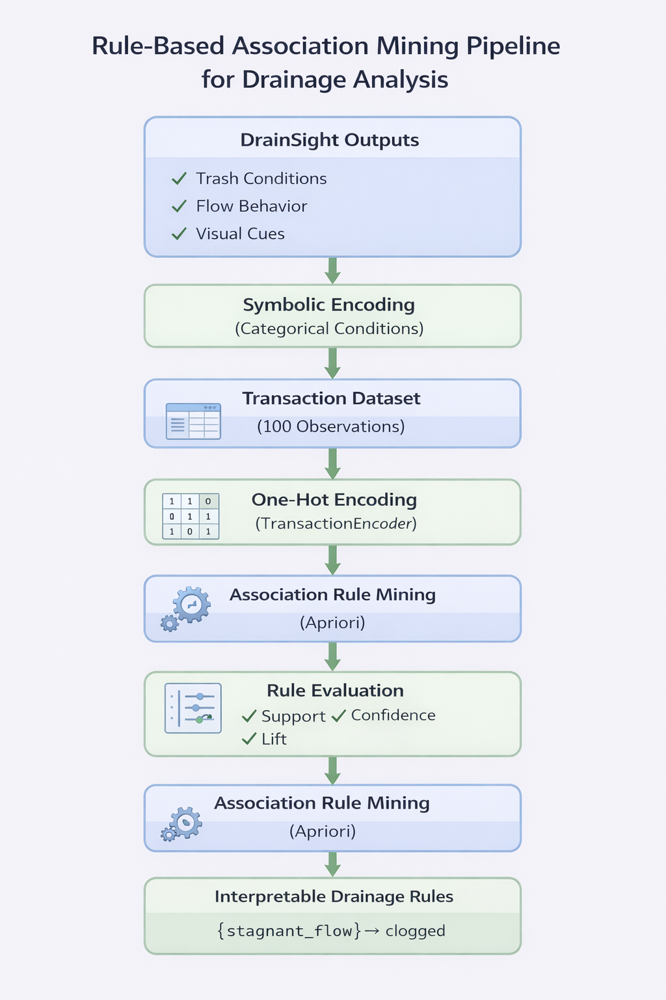

# Association Rule Mining of Urban Drainage Conditions for Clogging Detection
**CSC173 Intelligent Systems Final Project**  
*Mindanao State University - Iligan Institute of Technology*  
**Student:** Kaycee T. Nalzaro, 2021-1756  
**Semester:** AY 2025-2026 Sem 1
[](https://python.org) [](https://pytorch.org)

## Abstract
Urban drainage systems are critical components of city infrastructure, yet they are often affected by clogging caused by accumulated waste and poor water flow conditions. Identifying patterns 
that lead to drainage clogging can support early intervention and maintenance planning. This project applies Association Rule Mining (ARM) to analyze symbolic drainage conditions derived from the 
DrainSight system, an urban drainage monitoring project.

A synthetic transactional dataset consisting of 100 drainage observations was generated using domain knowledge-based rules. Each observation represents a combination of drainage conditions such as trash 
type, water flow behavior, visual water cues, and the resulting drainage state. The Apriori algorithm was applied to discover frequent itemsets and association rules linking observed conditions to 
drainage states such as clean, partially clogged, and clogged.

Experimental results reveal strong and interpretable rules, including relationships between stagnant flow, backflow, and heavy trash accumulation with clogged drainage states. Rule quality was evaluated 
using support, confidence, and lift metrics, ensuring meaningful and actionable insights. The study demonstrates that association rule mining can effectively complement computer vision-based systems by 
providing explainable decision logic for urban drainage monitoring.

## Table of Contents
- [Introduction](#introduction)
- [Related Work](#related-work)
- [Methodology](#methodology)
- [Experiments & Results](#experiments--results)
- [Discussion](#discussion)
- [Ethical Considerations](#ethical-considerations)
- [Conclusion](#conclusion)
- [Installation](#installation)
- [References](#references)

## Introduction
### Problem Statement
Urban drainage systems are frequently affected by clogging due to waste accumulation, stagnant water, and poor flow conditions. While computer vision systems such as DrainSight can detect visual and physical 
drainage conditions, translating these detections into clear and explainable decision rules remains a challenge. Without interpretable logic, maintenance decisions may rely heavily on manual inspection or heuristic judgment.

### Objectives
- Discover frequent drainage condition patterns using Association Rule Mining
- Identify interpretable rules that indicate clean, partially clogged, or clogged drainage states
- Provide explainable decision support logic that complements DrainSight detections

## Related Work
Association Rule Mining (ARM) has been widely studied as a data mining technique for discovering meaningful patterns and relationships in large and complex datasets. In the industrial and infrastructure domain, ARM has been 
applied to improve maintenance and reliability by extracting patterns indicative of system failures or operational issues from sensor and operational data, highlighting its value for condition monitoring and predictive maintenance tasks [1].
Studies have employed association rules to identify hidden associations in environmental monitoring and construction safety contexts, demonstrating the method’s utility in uncovering patterns related to risk factors and anomalies in complex systems [2].
Another study collectively suggest that ARM can be effectively adapted to analyze urban drainage conditions and detect clogging by discovering associations among flow characteristics, sensor readings, and environmental factors that traditional 
analysis might overlook [3]. Beyond classical hydraulic analyses, data-driven techniques are increasingly applied for infrastructure monitoring and pattern discovery in water networks. For example, machine learning and automated predictive models have 
been used to interpret overflow pollution mechanisms and link explanatory factors to drainage system behavior under wet weather, highlighting the value of uncovering complex relationships in drainage datasets [4].
These studies underscore the importance of understanding clog formation and its effects on drainage performance to guide effective maintenance planning and infrastructure design.

## Methodology
### Dataset
- **Source:** Synthetic drainage observations derived from DrainSight domain knowledge
- **Size:** 100 transactions
- **Representation:** Each transaction consists of symbolic drainage conditions
- **Item Categories:**
  - Trash conditions (e.g., heavy_trash, plastic_trash)
  - Flow behavior (e.g., stagnant_flow, backflow)
  - Visual cues (e.g., foam_present, dark_water)
  - Drainage state (clean, partially_clogged, clogged)
Each row represents one drainage observation encoded as a set of categorical items.

### Architecture


### Association Rule Mining Process
1. **Transaction Encoding:**
Drainage observations were converted into one-hot encoded representations using transaction encoding.
2. **Frequent Itemset Mining:**
The Apriori algorithm was applied to extract itemsets meeting a minimum support threshold.
3. **Rule Generation:**
Association rules were generated from frequent itemsets using confidence as the primary metric.
4. **Rule Filtering:**
Only rules predicting drainage states were retained for analysis.

### Parameters
| Parameter          | Value                     |
| ------------------ | ------------------------- |
| Algorithm          | Apriori                   |
| Minimum Support    | 0.10                      |
| Minimum Confidence | 0.70                      |
| Evaluation Metrics | Support, Confidence, Lift |

## Experiments & Results
### Metrics
The quality of discovered rules was evaluated using standard association rule metrics:
- **Support:** Frequency of itemset occurrence
- **Confidence:** Reliability of the rule
- **Lift:** Strength of association relative to random chance

### Sample Rules
| Antecedent    | Consequent        | Support | Confidence | Lift |
| ------------- | ----------------- | ------- | ---------- | ---- |
| stagnant_flow | clogged           | 0.17    | 1.00       | 1.82 |
| heavy_trash   | clogged           | 0.15    | 1.00       | 1.82 |
| backflow      | clogged           | 0.28    | 1.00       | 1.82 |
| slow_flow     | partially_clogged | 0.20    | 0.83       | 1.89 |

These rules demonstrate strong and interpretable relationships between drainage conditions and clogging states.

## Discussion
**Strengths:**
  - Produces interpretable and explainable rules
  - Low computational complexity and easy deployment

**Limitations:**
  - Dataset is synthetic and based on simulated observations
  - Rules reflect observed patterns rather than predictive generalization

**Insights:**
  - Flow behavior is a stronger indicator of clogging than visual appearance alone
  - Backflow and stagnant water consistently imply severe clogging

## Ethical Considerations
This study does not involve the use of personal, sensitive, or identifiable data, as all observations are synthetically generated 
and represent only symbolic drainage conditions. As a result, there are no privacy concerns related to individuals or communities. However, 
because the dataset is synthetic and based on simulated drainage scenarios, it may not fully capture the complexity and variability of 
real-world urban drainage systems, which introduces potential bias in the discovered patterns. The extracted association rules are intended 
solely to support infrastructure monitoring and maintenance decision-making and are not designed for surveillance or misuse beyond urban drainage management contexts.

## Conclusion
This project demonstrates the effectiveness of Association Rule Mining in extracting meaningful and interpretable drainage clogging patterns from symbolic DrainSight observations. By translating drainage conditions into explainable decision 
rules, the approach enhances the usability of urban monitoring systems. Future work may involve integrating real-world drainage data and combining rule-based insights with real-time computer vision outputs.

## Installation
1. Clone the repository:
   ```python
   git clone https://https://github.com/kyrr0o/CSC172-AssociationMining-Nalzaro
   ```         
2. Install dependencies:
   ```python
   pip install -r requirements.txt
   ```
3. Run association rule mining:
   ```python
   python main.ipynb
   ```
**Requirements:**
- pandas>=1.5.0
- mlxtend>=0.22.0
- numpy>=1.21.0

## Reference
- [1] Paiva, R. G., Cavalcante, C. A., & Do, P. (2024). Applying association rules in the maintenance and reliability of physical systems: A review. Computers & Industrial Engineering, 194, 110332.
- [2] Xu, Z., Huo, H., & Pang, S. (2022). Identification of environmental pollutants in construction site monitoring using association rule mining and ontology-based reasoning. Buildings, 12(12), 2111.
- [3] Piadeh, F., Behzadian, K., Chen, A. S., Kapelan, Z., Rizzuto, J. P., & Campos, L. C. (2023). Enhancing urban flood forecasting in drainage systems using dynamic ensemble-based data mining. Water Research, 247, 120791.
- [4] Wei, Q., Qi, Y., Chen, Y., Xie, Y., Yin, H., & Xu, Z. (2025). Data-driven interpretation of overflow pollution mechanism of urban drainage system using automated machine learning model. Journal of Water Process Engineering, 77, 108482.

